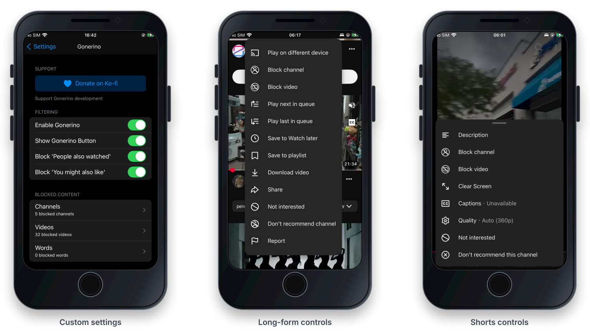
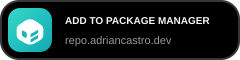
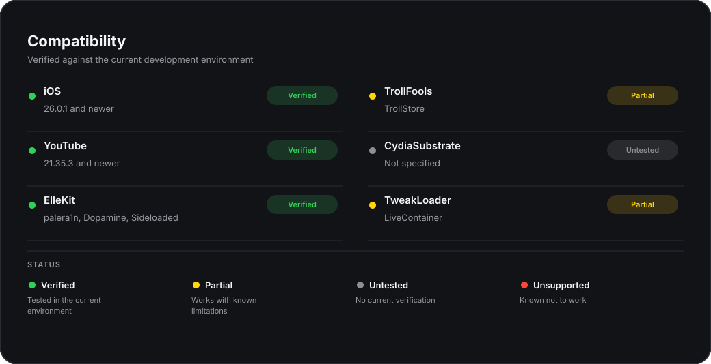

# Gonerino

A YouTube tweak that allows you to block specific channels and automatically remove their videos from your feed.

## Download

  
  

## Features

- Block channels or individual videos from YouTube menus
- Block items by channel, video, or keyword
- Remove blocked items from Home, Search and Shorts
- Hide “People also watched” and “You might also like” sections

## Compatibility

## Contributors

